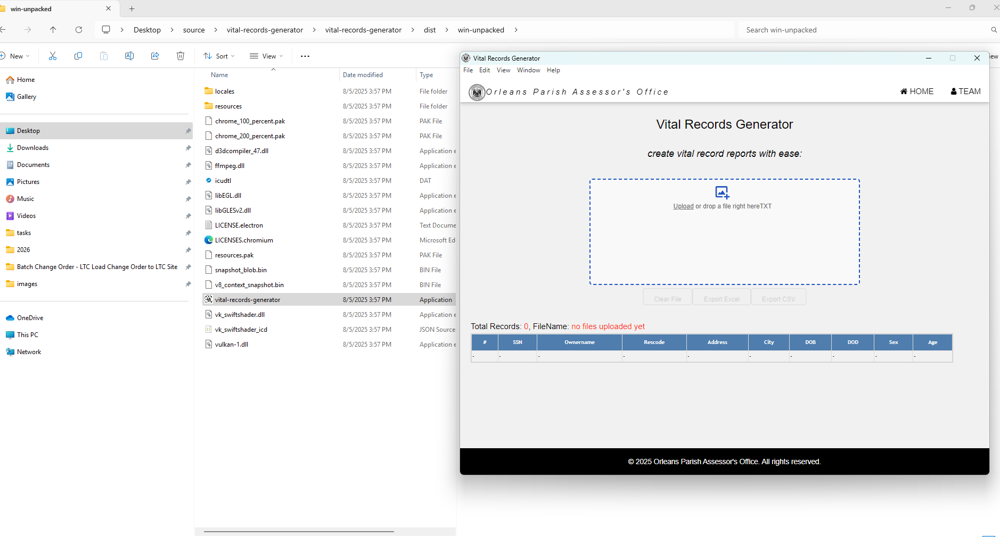
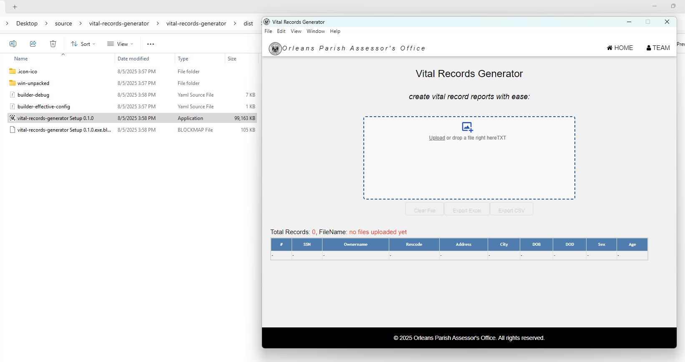
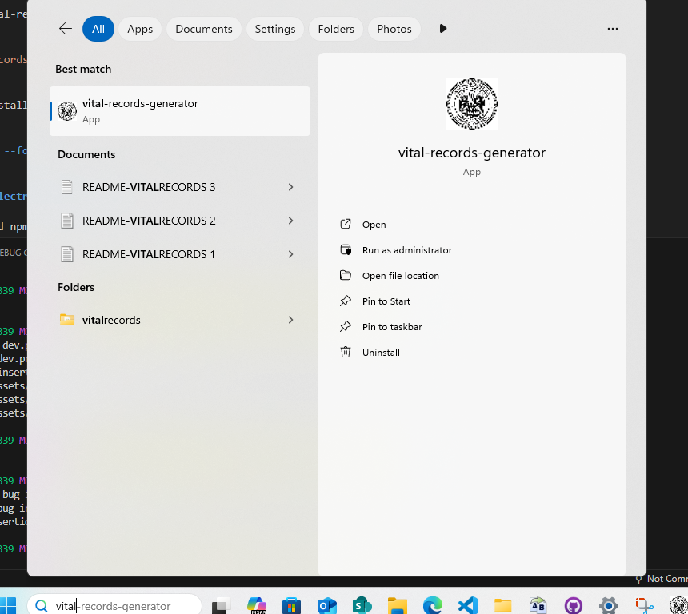
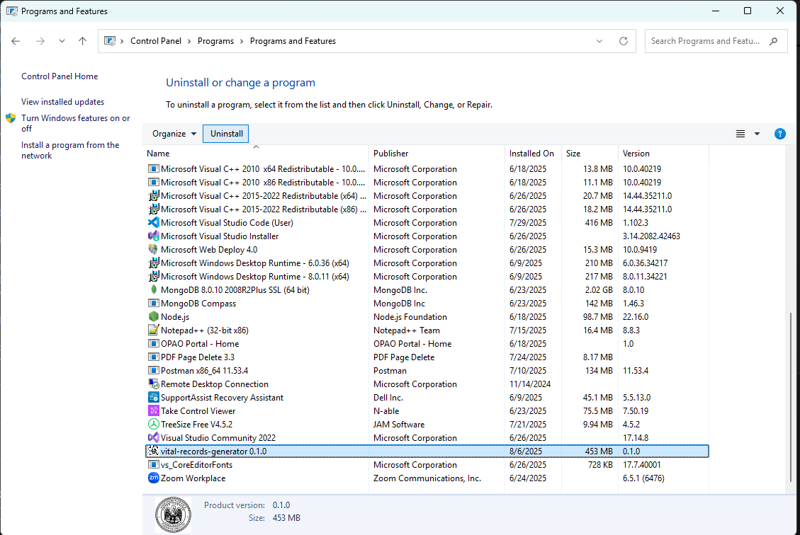

# **Vital Records Generator**

**Version:** 1.0.0
**Date:** June 4, 2025

---

## Description

Electron.

## Authors

[@jadogeri](https://www.github.com/jadogeri)
[@josephadogeriopao](https://www.github.com/josephadogeriopao)

## Repository

 [https://github.com/josephadogeriopao/vital-records-generator.git](https://github.com/josephadogeriopao/vital-records-generator.git)

## Screenshots

|  |  |
| -------------------------------------------- | -------------------------------------------- |
|                                              |                                              |

## Table of Contents

<ul>
    <li><a href="#1-introduction">1. Introduction</a>
        <ul>
          <li><a href="#11-purpose">1.1 Purpose</a> </li>
          <li><a href="#12-scope">1.2 Scope</a> </li>
          <li><a href="#13-intended-audience">1.3 Intended Audience</a> </li>
        </ul>
    </li>
    <li><a href="#2-technology-stack">2. Technology Stack</a> </li>
    <li><a href="#3-usage">3. Usage</a> 
        <ul>
            <li><a href="#30-run-electron-app-react">3.0 Run Electron App React</a> </li>
            <li><a href="#31-run-electron-app-development">3.1 Run Electron App Development</a> </li>
            <li><a href="#32-run-electron-app-production">3.2 Run Electron App Production</a> 
                <ul> 
                    <li><a href="#321-standalone-portable-version">3.2.1 Standalone (Portable) Version</a></li>
                    <li><a href="#322-installer-version">3.2.2  Installer Version</a></li>
                    <li><a href="#323-uninstalling-program">3.2.3  Uninstalling Program</a></li>
                </ul>
            </li>
        </ul>
    </li>  
    <li><a href="#4-license">4. License</a> </li>
    <li><a href="#5-references">5. References</a></li>
</ul>

## **1. Introduction**

### **1.1 Purpose**

This document outlines a template to build Electron App for windows.

### **1.2 Scope**

This template will allow users to:

- Package and build cross-platform desktop applications created with the Electron framework. 
- Simplifies the process of creating distributable packages for macOS, Windows, and Linux. 
- Generates installers, managing auto-updates, and bundling all the necessary files for distribution.

### **1.3 Intended Audience**

- Junior or Senior developers.
- Beginners learning typescript.

---

### **2. Technology Stack**

- **Programming Languages**: Typescript
- **IDE**: Visual Studio Code (VSCode)
- **Source Control**: Git and GitHub
- **Code Analysis**: SonarQube

### **3. Usage**

0 Open a terminal then type git clone https://github.com/josephadogeriopao/vital-records-generator.git
to download to project.

```bash
git clone https://github.com/josephadogeriopao/vital-records-generator.git

```

1 Type cd vital-records-generator/vital-records-generator to navigate into the app directory.

```bash
  cd vital-records-generator/vital-records-generator
```

2 Type npm install --force command to install dependencies.

```bash
  npm install --force
```

### 3.0 Run Electron App React ###

1 type command npm start to run the app in the development mode.\
Open [http://localhost:3000](http://localhost:3000) to view it in the browser.

The page will reload if you make edits.\
You will also see any lint errors in the console.

```bash
  npm start
```

### 3.1 Run Electron App Development ###

1 type command npm run electron:dev to run the app in electron app pane development mode.\

a build directory will be generated as shown below.

 


The desktop app will reload if you make edits.\
You will also see any lint errors in the developer tool console if enabled in main.ts (vital-records-generator/vital-records-generator/electron/main.ts).


```bash
  npm run electron:dev
```

### 3.2 Run Electron App Production ###

1 type command npm run electron:build to bundle app .\

a dist directory will be generated as shown below.

 


The desktop app will reload if you make edits.\
You will also see any lint errors in the developer tool console if enabled in main.ts (vital-records-generator/vital-records-generator/electron/main.ts).


```bash
  npm run electron:build
```

### 3.2.1 Standalone (Portable) Version ###

1 Navigate to /dist/win-unpacked directory.

2 Double click on vital-records-generator.exe (Application) to run the program.

 

The application can be run without installation.\

### 3.2.2  Installer version ###

1 Navigate to /dist/ directory.

2 Double click on vital-records-generator Setup 0.1.0 .exe (Application) to install the  program.

 

### 3.2.3  Uninstalling program ###

vital-records-generator application can be uninstalled via searching or control panel

### Searching ###

1 Search for program using search box, then press uninstall.

 

### Control Panel ###

1 Open control panel application.

2 Under Programs, click Uninstall a program.

3 Scroll and locate the application in the list.

4 Left click on the application, then click uninstall button.

 


## **4. License**

[LICENSE](/LICENSE)

---

## **5. References**

* FreeCodeCamp : [Frontend Web Development: (HTML, CSS, JavaScript, TypeScript, React)](https://www.youtube.com/watch?v=MsnQ5uepIa).
* AweSome Open Source : [Awesome Readme Templates](https://awesomeopensource.com/project/elangosundar/awesome-README-templates)
* Readme.so : [The easiest way to create a README](https://readme.so/)
* Medium : [How to fix__dirname](https://iamwebwiz.medium.com/how-to-fix-dirname-is-not-defined-in-es-module-scope-34d94a86694d)
